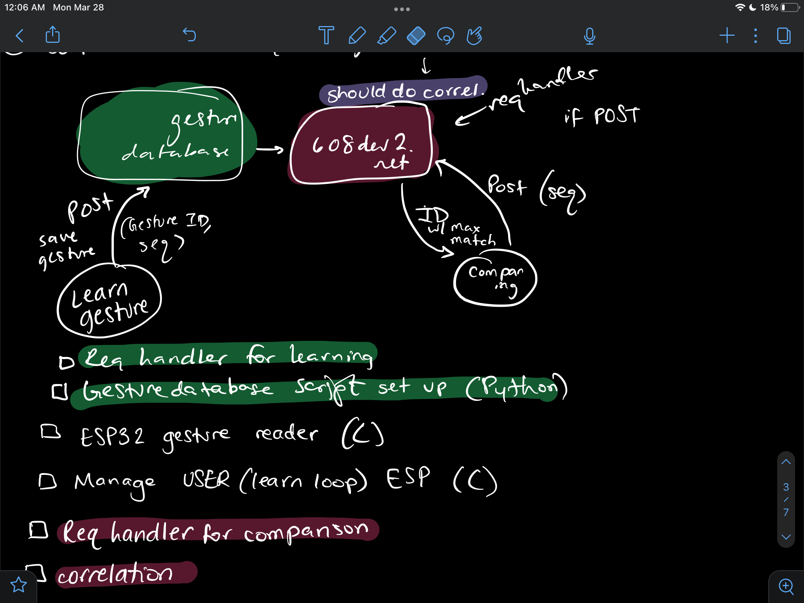
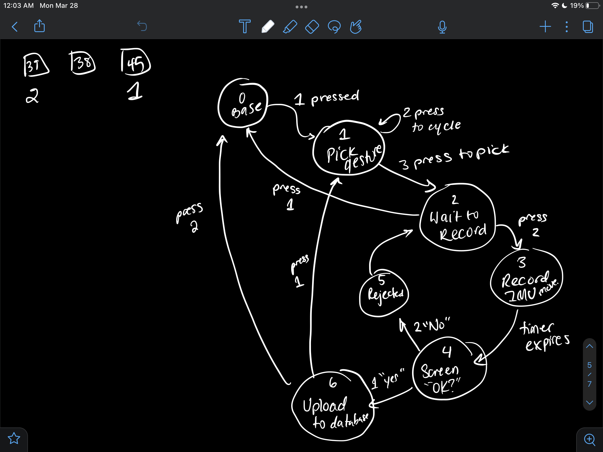
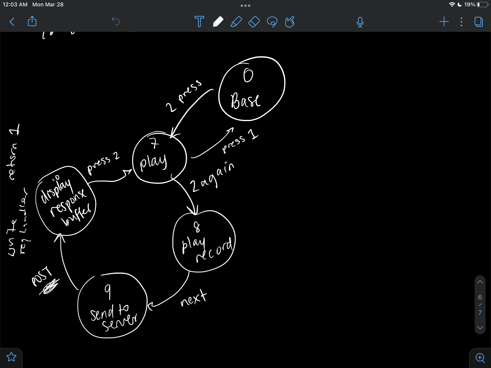

6.08 Design Exercise: Gestures
Shruthi Ravichandran

For this design exercise, the goal was to create a system that could record atleast 6 gestures in the  2D plane and then compare a new gesture against them and return whichever it was closest to. In order to do this, I split the problem up into four parts that I wrote separately. This split is drawn in the "overall_design.jpeg" file inside writeup_resources linked below. 



The first was an FSM that controlled the recording of a gesture and was moved forward using buttons. The second part was a server side script that interacted with the FSM via a Post Request from the ESP32 to upload the gesture data when it was learning a new gesture. The third was the rest of the FSM which controlled the comparison of a new gesture and was moved forward using buttons as well. The fourth section was another server side script that interacted with the FSM via a Post Request from the ESP32 that uploaded the gesture data from the compared gesture and would then return the gesture that had the highest correlation. The following writeup will speak to each of these sections in more detail.

This design was chosen because it modularized the problem into four targetable segments that could then be put together to display the final system. Due to a bug I was unable to debug, the post requests did not fully work so the second FSM response is mocked out in the video. However, the code is all written up (with the POST requests commented out just so it compiles). The bug was found to be when SQL was trying to upload the values from the ESP into its database, however it was unable to be fixed in time. 

A gesture was recorded using data from the IMU attached in lab 2. The IMU is an accelerometer that returns acceleration data in the x, y, and z planes. For this design exercise, only x and y were considered as the gestures only had to be valid in 2 dimensions. Both x and y value was stored in the database. 

To speak in more detail about the learning aspect of the system, a state diagram of the learning side is attached in writeup resources entitled "learn_fsm.jpeg" (shown below).



Instead of long and short presses, the system utilized three buttons (1,2,and 3). When button 1 was pressed, it turned on the learning aspect of the system. Button 2 was pressed to cycle through the possible gestures and button 3 was pressed in order to pick one. Button 2 was then pressed to record a gesture and the IMU data for the period of 5000 ms was stored in an array of floats. It's important to note that size here was a deliberate choice. The sampling period was 5 seconds, the array size was 50 samples large, meaning the delay was 100 seconds in order to sample 50 times in the span of 5 seconds. After speaking to a TA who assured me that using delay here was okay since it's not blocking any code in the main loop, I used delay to ensure samples were gathered such that no upsampling or downsampling had to be done later in the correlation aspect. After the data is gathered, it moves to the next state where a user decides whether they're happy with the gesture. If they are, they press button 1 to upload it and a POST request uploads the values to a data. The values in my code were stored in an array of floats. A function, "array_to_string" converted the array of floats to a string with strings in between the numbers by utilizing the following code:

```cpp

for(int i=0; i<50;i++){
    sprintf(&str_x[i*5], "%3.2f ", x_vals[i]);
    Serial.printf("%s", str_x);
    sprintf(&str_y[i*5], "%3.2f ", y_vals[i]);
    Serial.printf("%s", str_y);
  }
```
This code cycles through each value in x_vals array of x accelerations and y_vals of y accelerations and adds it to their respective strings by incrementing the string by 5 (to account for spaces in between and also to account for negative signs). Through testing this system, it's clear this function works. A post of this also worked so the post request was fine, however when this string was attempted to be placed in the database, it threw an "Operational Error: near "0.35": syntax error" that was not able to be debugged. Thus, in order to show the functionality of the rest of the system, this post request is commented out. 

The next phase is the server side of the learning (learning.py). This script creates the database with three columns (gesture number, x acc, y acc). It takes in a post request and parses the values from the body and then places them into the database. A get request was written for debugging purposes but is never utilized by the system. 

The next phase is the second part of the FSM which handles the comparisons. A state diagram of this aspect is attached in the writeup_resources folder, entitled "compare_fsm.jpeg" (shown below).



NOTE: Though these are labeled separately, they are part of the SAME fsm and in fact mirror structure at times. By pressing button 2, it brings the FSM into the compare state. Button 3 is pressed to begin the comparison and the action is recorded. Again, the IMU values are recorded into two float arrays (one for x, one for y). They're automatically sent to the server and the Post response is whichever gesture is most related and that is printed on the screen. A similar issue happened here with the POST. I wrote it out fully but due to some error it did not fully send the values to the FSM, so this part (AND ONLY THIS PART) has been mocked up in the video. 

To discuss the server side in greater dept (comparing.py): An offset and normalization function is written for correlation and this was originally written in an exercise in week 6. The request handler retrieves the values both from the new gesture to compare against and from the database previously created that stores all the values for the recorded gestures. Cycling through, we can now use numpy's dotting functionality to find the maximum correlation through two for loops. Through finding correlation with both the x and y, but storing the maximum, we ensure we find the closest match throughout both axes. This gesture associated with the highest correlation is returned and this is printed out on the LCD screen, ending the comparison cycle. If the post request had worked correctly, this part should function as intended.

In the broad picture, inside the loop, the button values are read and the fsm is run. Running it inside a larger loop allows for unending functionality. 

[demonstration video](https://youtu.be/V1lMPoKY354)


